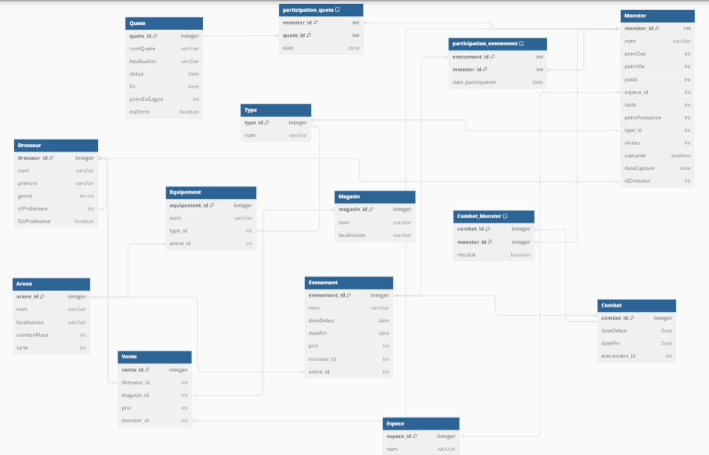

# Monstermon

Ce projet est un script Python qui automatise la création et la gestion d’une base de données MySQL nommée monstermon, modélisant un univers de jeu de type Pokémon, dans lequel sont définies et reliées plusieurs entités (monstres, dresseurs, combats, quêtes), avec insertion de données structurées, gestion des relations complexes et exécution de requêtes SQL permettant d’analyser l’état du système (captures, statistiques par type, participation aux événements et performances des monstres).

